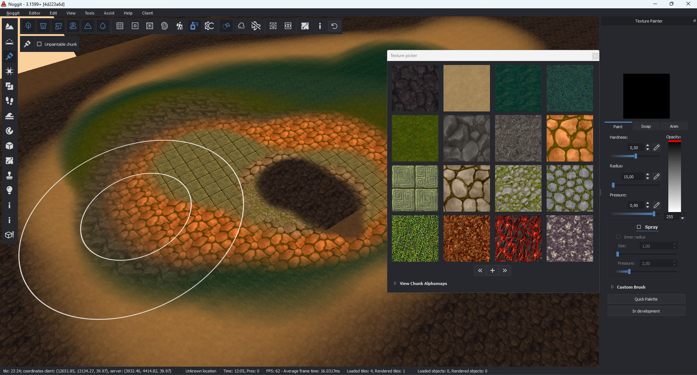
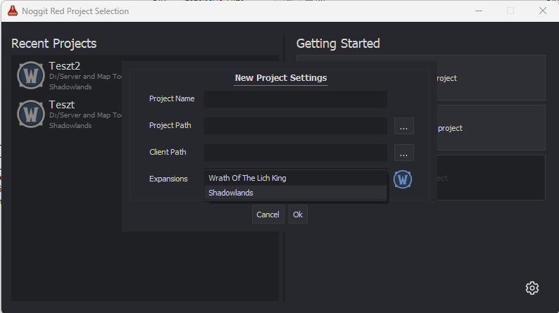

# ShadowWorld Noggit Red Modern

Experimental modern-client development fork of Noggit Red, maintained as
part of the ShadowWorld project.

This fork is based on Natsirt867's Noggit Red
`terrain-texture-layers-authoring` work and is being extended toward
native editing support for newer World of Warcraft map formats.

> **Work in Progress**
>
> Modern client support is experimental and incomplete. This repository
> should currently be considered a development/testing branch, not a
> production-ready modern WoW map editor.

## Preview

### Terrain Editing



*ShadowWorld Noggit Red Modern running the existing Noggit terrain and texture editing workflow. The editor shown here also includes the terrain texture layer authoring work this project builds upon.*

### Modern Client Project Creation



*Experimental Shadowlands 9.2.7 project target available during project creation.*

## Current Goal

The long-term goal is to allow Noggit to work with multiple WoW
client/map generations natively instead of requiring maps to be
converted back to the WotLK format for editing.

The intended workflow is eventually:

-   Select the target client/map version when creating a Noggit project.
-   Read assets and map data directly from the selected client.
-   Edit terrain using the appropriate format/features for that version.
-   Save/export the map in the selected target format.

The project architecture is being developed with future version-specific
readers/writers in mind rather than a single "modern support" checkbox.

## Current Development Status

### Working / Implemented

-   Existing WotLK/Noggit functionality remains the current editing
    foundation.
-   Project creation includes a **Shadowlands** project version option.
-   Modern CASC client initialization has been extended.
-   WoW `_retail_` client paths can be resolved to the installation root
    containing `.build.info`.
-   Client build detection using `.build.info` has been added.
-   Shadowlands **9.2.7** client data can be opened far enough for
    current development/testing.
-   Modern `Map.db2` definitions and layouts have been added.
-   WDC4 format detection has been added to the database library.
-   WDC4 data is currently routed through the WDC5 reader where
    compatible.
-   WDC3 record/section handling has additional bounds and safety
    checks.
-   Modern `Map.db2` field/layout differences are handled in several
    map/project UI paths.
-   Additional guards have been added around map, tile, asset and
    asynchronous loading.
-   Detailed asset/async loading diagnostics are currently enabled to
    help locate modern ADT loading failures.
-   The existing terrain texture layer authoring work supports up to **9
    terrain texture layers**.

### Partially Working / Experimental

-   Shadowlands 9.2.7 client reading.
-   Modern project creation and project loading.
-   Modern `Map.db2` reading.
-   Modern map discovery/listing.
-   Modern ADT loading.

Modern ADT loading is **not yet fully working**.

The current development state includes additional diagnostics
specifically to determine where loading fails when entering/opening a
modern ADT.

The current WIP snapshot has not yet been fully validated after the
latest ADT-loading changes.

### Not Yet Implemented

-   Complete Shadowlands 9.2.7 ADT loading.
-   Native modern ADT editing.
-   Native modern ADT saving/writing.
-   Creation of all required modern map database files for newly created
    maps.
-   Complete modern map creation workflow.
-   Native 12.x ADT support.
-   Native 12.x WMO loading/placement support.
-   Complete modern WMO support.
-   General multi-version export support.

## Version Direction

The current first target is **World of Warcraft 9.2.7 / Shadowlands**.

9.2.7 is being used as the first modern format target while the modern
project, CASC, DB2 and ADT infrastructure is developed.

Some included DBD definitions already contain `Map.db2` layouts for
later WoW versions, including 12.x builds. This does **not** mean Noggit
currently supports editing those versions.

Future development is intended to move toward selectable project/export
versions rather than treating all post-WotLK clients as one generic
"modern" format.

## Modern Terrain Texture Layers

This fork is based on the `terrain-texture-layers-authoring` development
branch and includes support for authoring terrain with up to **9 texture
layers**.

This is one of the foundations for moving beyond the traditional WotLK
terrain limitations.

## Modern ADT Development

Modern ADT support is currently the primary development focus.

The current approach is to extend Noggit's readers and data structures
so that modern terrain can eventually be read and edited natively rather
than relying permanently on an external down-conversion workflow.

At the current WIP stage, the editor can initialize modern
client/project data, but ADT loading still encounters unsupported or
incompatible data paths.

Extra diagnostics and safety guards are intentionally present in the
current branch to identify these failures.

## ShadowWorld Dependencies

This fork uses ShadowWorld-maintained branches of several Noggit
dependencies:

-   **ShadowWorld-Blizzard-Archive-Library**
    -   Modern CASC client path handling.
    -   `_retail_` installation root handling.
    -   CASC locale fallback required by the current modern-client
        workflow.
-   **ShadowWorld-Blizzard-Database-Library**
    -   WDC4 format recognition.
    -   WDC4/WDC5 reader compatibility work.
    -   Safer WDC3 section and record handling.
-   **ShadowWorld-DBD-Definitions**
    -   Extended `Map.db2` definitions.
    -   Shadowlands 9.2.7 layouts.
    -   Additional later-client `Map.db2` layouts used for future
        development.

These repositories are included as Git submodules.

Clone recursively:

``` bash
git clone --recursive <repository-url>
```

For an existing clone:

``` bash
git submodule update --init --recursive
```

## Development Philosophy

The goal is not to replace WotLK support with one hard-coded modern
client version.

The intended direction is a version-aware Noggit architecture where
projects can select their target client/map format and the appropriate
readers, writers and features can be used for that target.

This is still early development and the architecture may change
significantly while modern ADT support is being implemented.

## Community

Development discussion, testing and progress updates for ShadowWorld
Noggit Red Modern are available on the ShadowWorld Discord:

**Discord:** https://discord.gg/sgsRdfDWkD

## Contributions and Testing

Testing, research and contributions from other WoW modding developers
are welcome.

Especially useful areas currently include:

-   Shadowlands 9.2.7 ADT parsing.
-   Modern ADT chunk/layout research.
-   Modern `Map.db2` handling.
-   CASC asset loading.
-   Modern WMO loading.
-   Version-aware map readers/writers.
-   Testing modern terrain data in actual clients.

If you test this fork, please include the exact WoW client build and
relevant logs when reporting problems.

## Credits

This project builds upon the work of the Noggit community and the
developers of Noggit Red.

Special credit to:

-   Noggit / Noggit Red contributors.
-   Natsirt867 for the `terrain-texture-layers-authoring` branch and
    modern terrain-related work.
-   T1ti and contributors for the Blizzard archive/database libraries.
-   Prophecy-RP contributors for the build/DBD definition
    infrastructure.

ShadowWorld-specific modern client experimentation and integration is
maintained in this fork.

## Disclaimer

This project is experimental software intended for WoW modding and
research.

World of Warcraft and related assets/formats are property of Blizzard
Entertainment.

No Blizzard game assets are distributed with this repository.

------------------------------------------------------------------------

# Original Noggit Red Documentation

The documentation below originates from the upstream Noggit Red project
and is retained for build instructions, development information,
licensing information, and coding guidelines.

# Releases

Prebuilt executable are availables in the discord:
https://discord.gg/NqvM3xE5uS

# LICENSE

This software is open source software licensed under GPL3, as found in
the COPYING file.

# BUILDING

This project requires CMake to be built.

It also requires the following libraries:

-   OpenGL
-   StormLib (by Ladislav Zezula)
-   CascLib (by Ladislav Zezula)
-   Qt5
-   Lua5.x

On Windows you only need to install Qt5 yourself, the rest of the
dependencies are pulled through FetchContent automatically. Supporting
for Linux and Mac for this feature is coming in the future. In case
FetchContent is not available (e.g. no internet connection), the find
scripts will look for system installed libraries.

Further following libraries are required for MySQL GUID Storage builds:

-   LibMySQL
-   MySQLCPPConn See below for detailed instructions

## Windows

Text in `<brackets>` below are up to your choice but shall be replaced
with the same choice every time the same text is contained.

### MSVC++

Any recent version of Microsoft Visual C++ should work. Be sure to
remember which version you chose as later on you will have to pick
corresponding versions for other dependencies.

### CMake

Any recent CMake 3.x version should work. Just take the latest.

### Qt5

Install Qt5 to `<Qt-install>`, downloading a pre-built package from
https://www.qt.io/download-open-source/#section-2.

Note that during installation you only need **one** version of Qt and
also only **one** compiler version. If download size is noticably large
(more than a few hundred MB), you're probably downloading way too much.

### StormLib

This step is only required if pulling the dependency from FetchContent
is not available. Download StormLib from
https://github.com/ladislav-zezula/StormLib (any recent version).

-   open CMake GUI
-   set `CMAKE_INSTALL_PREFIX` (path) to `<Stormlib-install>` (folder
    should not yet exist). No other things should need to be configured.
-   open solution with visual studio
-   build ALL_BUILD
-   build INSTALL
-   Repeat for both release and debug.

### MySQL

Required for MySQL GUID Storage builds. download MySQL server
https://dev.mysql.com/downloads/installer/ and MySQL C++ Connector
https://dev.mysql.com/downloads/connector/cpp/ \* open CMake GUI \* set
`MYSQL_LIBRARY` (path) to `libmysql.lib` from your MYSQL server install.
e.g `"C:/Program Files/MySQL/MySQL Server 8.0/lib/libmysql.lib"` Note :
In new connector versions, developments components aren't included by
default anymore in the "Typical" setting, you need to enable
`Legacy JDBC API->Development Components` during installation. \* set
`MYSQLCPPCONN_INCLUDE` (path) to the folder containing
`cppconn/driver.h` from your MYSQL Connector C++ install. e.g
`"C:/Program Files/MySQL/Connector C++ 8.0/include/jdbc"` \* set
`MYSQLCPPCONN_LIBRARY` (path) to `mysqlcppconn.lib` from your MYSQL
Connector C++ install. e.g
`"C:/Program Files/MySQL/Connector C++ 8.0/lib64/vs14/mysqlcppconn.lib"`
\* Don't forget to set your SQL settings and enable the feature in the
noggit settings menu to use it.

### Noggit

-   open CMake GUI
-   set `CMAKE_PREFIX_PATH` (path) to
    `"<Qt-install>;<Stormlib-install>"`,
    e.g. `"C:/Qt/5.6/msvc2015;D:/StormLib/install"`
-   set `BOOST_ROOT` (path) to `<boost-install>`,
    e.g. `"C:/local/boost_1_60_0"`
-   (**unlikely to be required:**) move the libraries of Boost from
    where they are into `BOOST_ROOT/lib` so that CMake finds them
    automatically or set `BOOST_LIBRARYDIR` to where your lib are (.dll
    and .lib). Again, this is **highly** unlikely to be required.
-   set `CMAKE_INSTALL_PREFIX` (path) to an empty destination, e.g. 
    `"C:/Users/blurb/Documents/noggitinstall`
-   configure, generate
-   open solution with visual studio
-   build ALL_BUILD
-   build INSTALL

To launch noggit you will need the following DLLs from Qt loadable.
Install them in the system, or copy them from `C:/Qt/X.X/msvcXXXX/bin`
into the directory containing noggit.exe, i.e. `CMAKE_INSTALL_PREFIX`
configured.

-   release: Qt5Core, Qt5OpenGL, Qt5Widgets, Qt5Gui
-   debug: Qt5Cored, Qt5OpenGLd, Qt5Widgetsd, Qt5Guid

## Linux

On **Ubuntu** you can install the building requirements using:

``` bash
sudo apt install freeglut3-dev libboost-all-dev qt5-default libstorm-dev
```

Compile and build using:

``` bash
mkdir build
cd build
cmake ..
make -j $(nproc)
```

Instead of `make -j $(nproc)` you may want to pick a bigger number than
`$(nproc)`, e.g. the number of `CPU cores * 1.5`.

If the build pass correctly without errors, you can go into build/bin/
and run noggit. Note that `make install` will probably work but is not
tested, and nobody has built distributable packages in years.

# SUBMODULES

To pull the latest version of submodules use the following command at
the root directory.

``` bash
git submodule update --recursive --remote
```

# CODING GUIDELINES

File naming rules:

`.hpp` - is used for header files (C++ language).

`.h` - is used **only** for header files or modules written in C
language.

`.c` - is used **only** for implementation files or modules written in C
language.

`.cpp` - is used for project implementation files.

`.inl` - is used for include files providing template instantiations.

`.ui` - is used for QT UI definitions (output of QtDesigner/QtCreator).

### Project structure:

`/src/Noggit` - is the main directory hosting .cpp, .hpp, .inl, .ui
files of the project.

Within this directory the subdirs should correspond to namespace names
(case sensitive).

File names should use PascalCase (e.g. `FooBan.hpp`) and either
correspond to the type defined in the file, or represent sematics of the
module.

`/src/External` - is the directory of hosting included libraries and
subprojects. This is external or modified external code, so no rules
from Noggit project apply to its content.

`/src/Glsl` - is the directory to store .glsl shaders for the OpenGL
renderer. It is not recommended, but not strictly prohibited to inline
shader code as strings to `.cpp` implementation files.

### Code style

Following is an example for file `src/Noggit/Ui/FooBan.hpp`.

``` cpp
#ifndef INCLUDE_GUARD_BASED_ON_FILENAME
#define INCLUDE_GUARD_BASED_ON_FILENAME
// We do not use #pragma once in headers as it is technically not cross-platform.
// Use include guards instead. For example, CLion IDE creates them automatically on .hpp file creation.

// <> are prefered for includes.
// Local imports go here
#include <SomeLocalFile.hpp>

// Lib imports go here
#include <external/SomeLibCode.hpp

// STL imports go here
#include <string>
#include <mutex>
#include <vector> // etc

// Forward declarations in headers are encouraged. That prevents type leaking into bigger scopes
// Also reduces compile time
namespace Parent::SomeOtherChild
{
  class ForwardDeclaredClass;
}

// Namespaces are defined as PascalCase names. Namespace concatenation for nested namespaces
// is adviced, but not strictly enforced.
namespace Parent::Child
{
  // types are name in PascalCase,
  class Test : public TestBase
  {
    public:
      Test();
     
      int x; // public fields like that are discourged, but occur here and there through the project. 
      // Subject to refactoring.
      
      // methods are named in camelCase.
      // trivial getter methods are declared in the header file.
      int somePrivateMember() { return _some_private_member; } const;

      // trivial setters are declared in the header file. Preceded by "set" prefix.
      void setSomePrivateMember(int a) { _some_private_member = a; };
    
    // private members are snake lower case, separated by underscore, preceded by underscore to indicate they're private.
    private:
      int _some_private_member;
      ForwardDeclaredClass* _some_other_private_member_using_forward_decl;
      std::mutex _mutex;

    // static methods

    private:
      static void someStaticMethod();
    
  };
}

#endif
```

Following is an example for file `src/Noggit/Ui/FooBan.cpp`.

``` cpp
// the header of this .cpp comes first
// <> are prefered for includes.
#include <Noggit/Ui/FooBan.hpp>

// same order of includes as in header.

using namespace Parent::Child;

Test::Test()
: TestBase("some_arg")
, _some_private_member(0)
, _some_other_private_member_using_forward_decl(new ForwardDeclaredClass()) // do not forget to import ForwardDeclaredClass in .cpp
{
// body of ctor
}

void Test::someStaticMethod()
{
// local variables are named in snake_case, no preceding underscore.
int local_var = 0;

// preceding underscore is used on variables that are used for RAII patterns, such as scoped stuff (e.g. a scoped mutex)
std::lock_guard<std::mutex> _lock (_mutex); // _lock is never accessed later, it just needs to live as long as the scope lives.
// So, it has an underscore prefix.

someFunc(local_var); // free floating functions use the same naming rules as methods
}
```

Additional examples:

``` cpp

constexpr unsigned SOME_CONSTANT = 10; // constants are named in SCREAMING_CASE
#define SOME_MACRO // macro definitions are named in SCREAMING_CASE
```
