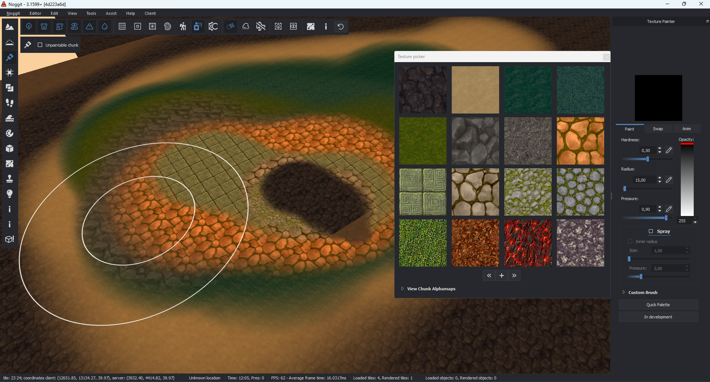
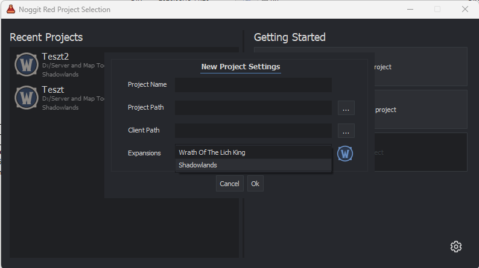

# ShadowWorld Noggit Red Modern

ShadowWorld's multi-client fork of Noggit Red. One executable provides project
targets for Wrath of the Lich King, Shadowlands 9.2.7, Retail 12.1, and
Forever 1.60.x; these are not separate client builds.

This fork is based on Natsirt867's Noggit Red
`terrain-texture-layers-authoring` work and extends the editor to newer
World of Warcraft map formats.

> **Supported builds and backups**
>
> The core project, map, terrain, object, and save workflows are available for
> the four targets above in a single build. Forever is a beta client and its
> data layouts may change between updates. Keep backups of maps before editing
> and verify important changes in the matching game client.

Shadowlands, Retail, and Forever terrain edits and M2/WMO placements are saved
in their respective modern map formats. WotLK projects continue to save in the
WotLK format. Cross-version conversion is planned for a later release; saving
a project does not convert it to another client version.

The editor enables loading, painting, rendering, and saving up to **16 terrain
texture layers per chunk in all four project types**. Each project still saves
in its selected client format: WotLK stays WotLK, while Shadowlands, Retail,
and Forever use their respective modern formats. The editor's 16-layer limit
does not by itself guarantee that every game client accepts every layer setup.

## Preview

### Terrain Editing



*ShadowWorld Noggit Red Modern running the existing Noggit terrain and texture editing workflow. The editor shown here also includes the terrain texture layer authoring work this project builds upon.*

### Modern Client Project Creation



*Project creation supports WotLK, Shadowlands, Retail, and Forever targets.*

## Workflow

The goal is to work with multiple WoW client/map generations in one editor
without requiring maps to be converted back to WotLK. The workflow is:

-   Select the target client/map version when creating a Noggit project.
-   Read assets and map data directly from the selected client.
-   Edit terrain and objects using the appropriate format/features.
-   Save terrain and M2/WMO placement changes in the selected project's native
    map format.

Version-specific readers and writers handle the differences between clients.

## Current Capabilities

### Available in This Build

-   Existing WotLK/Noggit functionality remains the current editing
    foundation.
-   The project selector and project creation offer **WotLK, Shadowlands,
    Retail, and Forever** in the same executable.
-   Modern CASC client initialization has been extended.
-   WoW `_retail_` client paths can be resolved to the installation root
    containing `.build.info`.
-   Client build detection using `.build.info` has been added.
-   Shadowlands **9.2.7** and Retail **12.1** client data are read through
    CASC; terrain, M2s, and WMOs are handled by version-aware paths.
-   Forever **1.60.x** CASC and its distinct `Map.db2` WDC5 layout have
    dedicated support. New beta client layouts can still require updates.
-   The project list can be forced at startup with
    `noggit.exe --project-selector`.
-   Modern `Map.db2` and `LiquidType.db2` definitions/layouts have been
    added, including layout-hash selection for the supported builds.
-   WDC4 format detection has been added to the database library.
-   WDC4 data is currently routed through the WDC5 reader where
    compatible.
-   WDC3 record/section handling has additional bounds and safety
    checks.
-   Modern `Map.db2` field/layout differences are handled in several
    map/project UI paths.
-   Additional guards have been added around map, tile, asset and
    asynchronous loading.
-   Asset and asynchronous loading diagnostics help identify unsupported
    client data and map failures.
-   Terrain texture loading, painting, and rendering support up to **16
    texture layers per chunk**. This is a code limit, not a guarantee that
    every target client accepts every combination.
-   Modern split ADT saving writes terrain/texture and M2/WMO placement parts
    in the selected modern format, including `_obj1.adt` and `_lod.adt` where
    applicable. WotLK retains its existing ADT save path.
-   The project selector uses a Shadow-World themed, animated Qt interface.

### Compatibility Notes

-   Client-specific DB2 layouts can change, especially in Forever beta builds;
    a matching table hash does not always imply an identical record layout.
-   Some modern materials, lighting, particles, liquids, and WMO variants may
    render differently from the game client.
-   Test important saved terrain and object changes in the matching game
    client. The four targets have not been exhaustively regression-tested
    after every change.

### Outside the Current Scope

-   Automatic creation of every database file needed by a completely new
    modern map.
-   Two-way WotLK/modern map conversion. This is planned for a later release,
    not performed by the current save operation.

## Version Direction

The modern reader and writer keep **9.2.7 / Shadowlands** support alongside
version-aware paths for **Retail 12.1** and **Forever 1.60.x**. WotLK
retains its existing editing and WotLK-format saving behavior.

Some included DBD definitions already contain `Map.db2` layouts for
later WoW versions, including 12.x builds. This does **not** mean Noggit
currently supports editing those versions.

Future development is intended to add explicit two-way conversion between
client formats rather than treating all post-WotLK clients as one generic
"modern" format.

## Modern Terrain Texture Layers

This fork is based on the `terrain-texture-layers-authoring` development
branch. The 16-layer path is enabled for terrain loading, painting, rendering,
and saving across WotLK, Shadowlands, Retail, and Forever projects. The target
client's format and renderer still decide which layer combinations can be used
in game.

## Modern ADT Development

Modern split ADTs are loaded from the selected client's storage. The writer
preserves and updates supported root, texture, and object parts rather than
down-converting the map to WotLK. Unsupported layouts or assets may still
fail; diagnostics and safety guards remain enabled. Check the saved result
in the matching game client before relying on it.

## ShadowWorld Dependencies

This fork uses ShadowWorld-maintained branches of several Noggit
dependencies:

-   **ShadowWorld-Blizzard-Archive-Library**
    -   Modern CASC client path handling.
    -   `_retail_` installation root handling.
    -   CASC locale fallback required by the current modern-client
        workflow.
-   **ShadowWorld-Blizzard-Database-Library**
    -   WDC4 format recognition.
    -   WDC4/WDC5 reader compatibility work.
    -   Safer WDC3 section and record handling.
-   **ShadowWorld-DBD-Definitions**
    -   Extended `Map.db2` definitions.
    -   Shadowlands 9.2.7 layouts.
    -   Additional later-client `Map.db2` layouts used for future
        development.

These repositories are included as Git submodules.

Clone recursively:

``` bash
git clone --recursive --branch shadowworld-modern-retail-preview \
  https://github.com/Jedert-ShadowWorld/ShadowWorld-Noggit-Red-Modern.git
```

For an existing clone:

``` bash
git submodule update --init --recursive
```

Example Windows build with Visual Studio 2022 and Qt 5.15:

``` powershell
cmake -S . -B build -A x64 -DQt5_DIR="<Qt-install>/lib/cmake/Qt5"
cmake --build build --config Release --target noggit -j 8
```

The executable is written to `build/bin/Release`. Run
`noggit.exe --project-selector` to always open the project selection
window instead of automatically loading the configured or favorite
project.

## Development Philosophy

The goal is not to replace WotLK support with one hard-coded modern
client version.

The intended direction is a version-aware Noggit architecture where
projects can select their target client/map format and the appropriate
readers, writers and features can be used for that target.

The supported client paths share one executable while retaining
version-specific parsing and saving behavior. New client builds may
require updates to those paths.

## Community

Development discussion, testing and progress updates for ShadowWorld
Noggit Red Modern are available on the ShadowWorld Discord:

**Discord:** https://discord.gg/sgsRdfDWkD

## Contributions and Testing

Testing, research and contributions from other WoW modding developers
are welcome.

Especially useful areas currently include:

-   Shadowlands 9.2.7 ADT parsing.
-   Modern ADT chunk/layout research.
-   Modern `Map.db2` handling.
-   CASC asset loading.
-   Modern WMO loading.
-   Version-aware map readers/writers.
-   Testing modern terrain data in actual clients.

If you test this fork, please include the exact WoW client build and
relevant logs when reporting problems.

## Credits

This project builds upon the work of the Noggit community and the
developers of Noggit Red.

Special credit to:

-   Noggit / Noggit Red contributors.
-   Natsirt867 for the `terrain-texture-layers-authoring` branch and
    modern terrain-related work.
-   T1ti and contributors for the Blizzard archive/database libraries.
-   Prophecy-RP contributors for the build/DBD definition
    infrastructure.

ShadowWorld-specific modern client experimentation and integration is
maintained in this fork.

## Disclaimer

This is community-developed software intended for WoW modding and
research. Back up project data before editing, especially when using
new or beta client builds.

World of Warcraft and related assets/formats are property of Blizzard
Entertainment.

No Blizzard game assets are distributed with this repository.

------------------------------------------------------------------------

# Original Noggit Red Documentation

The documentation below originates from the upstream Noggit Red project
and is retained for build instructions, development information,
licensing information, and coding guidelines.

# Releases

Prebuilt executable are availables in the discord:
https://discord.gg/NqvM3xE5uS

# LICENSE

This software is open source software licensed under GPL3, as found in
the COPYING file.

# BUILDING

This project requires CMake to be built.

It also requires the following libraries:

-   OpenGL
-   StormLib (by Ladislav Zezula)
-   CascLib (by Ladislav Zezula)
-   Qt5
-   Lua5.x

On Windows you only need to install Qt5 yourself, the rest of the
dependencies are pulled through FetchContent automatically. Supporting
for Linux and Mac for this feature is coming in the future. In case
FetchContent is not available (e.g. no internet connection), the find
scripts will look for system installed libraries.

Further following libraries are required for MySQL GUID Storage builds:

-   LibMySQL
-   MySQLCPPConn See below for detailed instructions

## Windows

Text in `<brackets>` below are up to your choice but shall be replaced
with the same choice every time the same text is contained.

### MSVC++

Any recent version of Microsoft Visual C++ should work. Be sure to
remember which version you chose as later on you will have to pick
corresponding versions for other dependencies.

### CMake

Any recent CMake 3.x version should work. Just take the latest.

### Qt5

Install Qt5 to `<Qt-install>`, downloading a pre-built package from
https://www.qt.io/download-open-source/#section-2.

Note that during installation you only need **one** version of Qt and
also only **one** compiler version. If download size is noticably large
(more than a few hundred MB), you're probably downloading way too much.

### StormLib

This step is only required if pulling the dependency from FetchContent
is not available. Download StormLib from
https://github.com/ladislav-zezula/StormLib (any recent version).

-   open CMake GUI
-   set `CMAKE_INSTALL_PREFIX` (path) to `<Stormlib-install>` (folder
    should not yet exist). No other things should need to be configured.
-   open solution with visual studio
-   build ALL_BUILD
-   build INSTALL
-   Repeat for both release and debug.

### MySQL

Required for MySQL GUID Storage builds. download MySQL server
https://dev.mysql.com/downloads/installer/ and MySQL C++ Connector
https://dev.mysql.com/downloads/connector/cpp/ \* open CMake GUI \* set
`MYSQL_LIBRARY` (path) to `libmysql.lib` from your MYSQL server install.
e.g `"C:/Program Files/MySQL/MySQL Server 8.0/lib/libmysql.lib"` Note :
In new connector versions, developments components aren't included by
default anymore in the "Typical" setting, you need to enable
`Legacy JDBC API->Development Components` during installation. \* set
`MYSQLCPPCONN_INCLUDE` (path) to the folder containing
`cppconn/driver.h` from your MYSQL Connector C++ install. e.g
`"C:/Program Files/MySQL/Connector C++ 8.0/include/jdbc"` \* set
`MYSQLCPPCONN_LIBRARY` (path) to `mysqlcppconn.lib` from your MYSQL
Connector C++ install. e.g
`"C:/Program Files/MySQL/Connector C++ 8.0/lib64/vs14/mysqlcppconn.lib"`
\* Don't forget to set your SQL settings and enable the feature in the
noggit settings menu to use it.

### Noggit

-   open CMake GUI
-   set `CMAKE_PREFIX_PATH` (path) to
    `"<Qt-install>;<Stormlib-install>"`,
    e.g. `"C:/Qt/5.6/msvc2015;D:/StormLib/install"`
-   set `BOOST_ROOT` (path) to `<boost-install>`,
    e.g. `"C:/local/boost_1_60_0"`
-   (**unlikely to be required:**) move the libraries of Boost from
    where they are into `BOOST_ROOT/lib` so that CMake finds them
    automatically or set `BOOST_LIBRARYDIR` to where your lib are (.dll
    and .lib). Again, this is **highly** unlikely to be required.
-   set `CMAKE_INSTALL_PREFIX` (path) to an empty destination, e.g. 
    `"C:/Users/blurb/Documents/noggitinstall`
-   configure, generate
-   open solution with visual studio
-   build ALL_BUILD
-   build INSTALL

To launch noggit you will need the following DLLs from Qt loadable.
Install them in the system, or copy them from `C:/Qt/X.X/msvcXXXX/bin`
into the directory containing noggit.exe, i.e. `CMAKE_INSTALL_PREFIX`
configured.

-   release: Qt5Core, Qt5OpenGL, Qt5Widgets, Qt5Gui
-   debug: Qt5Cored, Qt5OpenGLd, Qt5Widgetsd, Qt5Guid

## Linux

On **Ubuntu** you can install the building requirements using:

``` bash
sudo apt install freeglut3-dev libboost-all-dev qt5-default libstorm-dev
```

Compile and build using:

``` bash
mkdir build
cd build
cmake ..
make -j $(nproc)
```

Instead of `make -j $(nproc)` you may want to pick a bigger number than
`$(nproc)`, e.g. the number of `CPU cores * 1.5`.

If the build pass correctly without errors, you can go into build/bin/
and run noggit. Note that `make install` will probably work but is not
tested, and nobody has built distributable packages in years.

# SUBMODULES

To pull the latest version of submodules use the following command at
the root directory.

``` bash
git submodule update --recursive --remote
```

# CODING GUIDELINES

File naming rules:

`.hpp` - is used for header files (C++ language).

`.h` - is used **only** for header files or modules written in C
language.

`.c` - is used **only** for implementation files or modules written in C
language.

`.cpp` - is used for project implementation files.

`.inl` - is used for include files providing template instantiations.

`.ui` - is used for QT UI definitions (output of QtDesigner/QtCreator).

### Project structure:

`/src/Noggit` - is the main directory hosting .cpp, .hpp, .inl, .ui
files of the project.

Within this directory the subdirs should correspond to namespace names
(case sensitive).

File names should use PascalCase (e.g. `FooBan.hpp`) and either
correspond to the type defined in the file, or represent sematics of the
module.

`/src/External` - is the directory of hosting included libraries and
subprojects. This is external or modified external code, so no rules
from Noggit project apply to its content.

`/src/Glsl` - is the directory to store .glsl shaders for the OpenGL
renderer. It is not recommended, but not strictly prohibited to inline
shader code as strings to `.cpp` implementation files.

### Code style

Following is an example for file `src/Noggit/Ui/FooBan.hpp`.

``` cpp
#ifndef INCLUDE_GUARD_BASED_ON_FILENAME
#define INCLUDE_GUARD_BASED_ON_FILENAME
// We do not use #pragma once in headers as it is technically not cross-platform.
// Use include guards instead. For example, CLion IDE creates them automatically on .hpp file creation.

// <> are prefered for includes.
// Local imports go here
#include <SomeLocalFile.hpp>

// Lib imports go here
#include <external/SomeLibCode.hpp

// STL imports go here
#include <string>
#include <mutex>
#include <vector> // etc

// Forward declarations in headers are encouraged. That prevents type leaking into bigger scopes
// Also reduces compile time
namespace Parent::SomeOtherChild
{
  class ForwardDeclaredClass;
}

// Namespaces are defined as PascalCase names. Namespace concatenation for nested namespaces
// is adviced, but not strictly enforced.
namespace Parent::Child
{
  // types are name in PascalCase,
  class Test : public TestBase
  {
    public:
      Test();
     
      int x; // public fields like that are discourged, but occur here and there through the project. 
      // Subject to refactoring.
      
      // methods are named in camelCase.
      // trivial getter methods are declared in the header file.
      int somePrivateMember() { return _some_private_member; } const;

      // trivial setters are declared in the header file. Preceded by "set" prefix.
      void setSomePrivateMember(int a) { _some_private_member = a; };
    
    // private members are snake lower case, separated by underscore, preceded by underscore to indicate they're private.
    private:
      int _some_private_member;
      ForwardDeclaredClass* _some_other_private_member_using_forward_decl;
      std::mutex _mutex;

    // static methods

    private:
      static void someStaticMethod();
    
  };
}

#endif
```

Following is an example for file `src/Noggit/Ui/FooBan.cpp`.

``` cpp
// the header of this .cpp comes first
// <> are prefered for includes.
#include <Noggit/Ui/FooBan.hpp>

// same order of includes as in header.

using namespace Parent::Child;

Test::Test()
: TestBase("some_arg")
, _some_private_member(0)
, _some_other_private_member_using_forward_decl(new ForwardDeclaredClass()) // do not forget to import ForwardDeclaredClass in .cpp
{
// body of ctor
}

void Test::someStaticMethod()
{
// local variables are named in snake_case, no preceding underscore.
int local_var = 0;

// preceding underscore is used on variables that are used for RAII patterns, such as scoped stuff (e.g. a scoped mutex)
std::lock_guard<std::mutex> _lock (_mutex); // _lock is never accessed later, it just needs to live as long as the scope lives.
// So, it has an underscore prefix.

someFunc(local_var); // free floating functions use the same naming rules as methods
}
```

Additional examples:

``` cpp

constexpr unsigned SOME_CONSTANT = 10; // constants are named in SCREAMING_CASE
#define SOME_MACRO // macro definitions are named in SCREAMING_CASE
```
